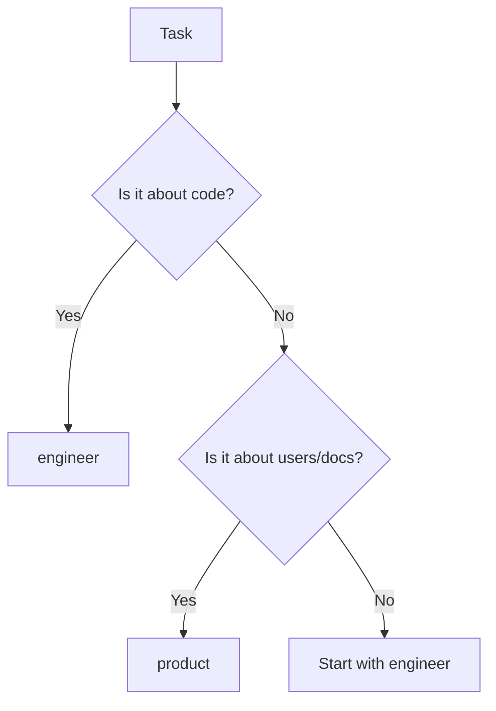

# Claude Code Agents for Regender-XYZ (Ultra-Simplified)

## 🎯 Philosophy: Maximum Impact, Minimum Complexity

We've radically simplified from 8 specialized agents to just **2 powerful agents** that handle everything.

## Available Agents (Only 2!)

### 🔧 `engineer`
**The Builder** - Everything code-related in one capable agent.

**Core Capabilities:**
- **Build**: Features, bug fixes, refactoring
- **Review**: Code quality, security, patterns
- **Test**: Unit tests, integration, edge cases
- **Optimize**: Performance, memory, complexity

**Example Usage:**
```bash
Task(engineer, "add batch processing for multiple books")
Task(engineer, "fix the memory leak in character analysis")
Task(engineer, "refactor parser service for better maintainability")
Task(engineer, "optimize transformation to be 2x faster")
```

### 📝 `product`
**The Planner** - Everything user and product related.

**Core Capabilities:**
- **Plan**: Features, requirements, success metrics
- **Design**: CLI UX, user flows, error messages
- **Document**: Guides, API docs, architecture
- **Analyze**: Usage patterns, improvements

**Example Usage:**
```bash
Task(product, "plan interactive character selection feature")
Task(product, "improve error messages to be more helpful")
Task(product, "document the transformation service API")
Task(product, "design better progress indication")
```

## Why This Works Better

### Before (Complex)
❌ 8 agents with overlapping responsibilities
❌ Complex orchestration patterns
❌ High cognitive overhead choosing agents
❌ Excessive token usage (200k × multiple agents)
❌ Rigid workflow definitions

### After (Simple)
✅ 2 agents with clear separation
✅ No orchestration needed
✅ Natural language requests
✅ Efficient token usage
✅ Flexible and adaptive

## Usage Patterns

### Single Agent (90% of tasks)
Most tasks only need one agent:

```bash
# Code tasks → engineer
Task(engineer, "implement rate limiting for OpenAI provider")

# Product tasks → product
Task(product, "write user guide for transformation types")
```

### Both Agents (10% of complex features)
Only use both for truly complex, cross-domain work:

```bash
# Parallel (when independent)
Task(product, "design batch processing UX")
Task(engineer, "research batch processing libraries")

# Sequential (when dependent)
Task(product, "define requirements for streaming output")
# Then after product completes...
Task(engineer, "implement streaming based on product requirements")
```

## Decision Guide



## Common Tasks Mapping

| Task Type | Agent | Example |
|-----------|-------|---------|
| Add feature | `engineer` | "add progress bars to transformation" |
| Fix bug | `engineer` | "fix parsing error with apostrophes" |
| Optimize | `engineer` | "make character analysis 3x faster" |
| Code review | `engineer` | "review the provider implementations" |
| Plan feature | `product` | "plan voice narration feature" |
| Improve UX | `product` | "make CLI more intuitive" |
| Write docs | `product` | "document setup process" |
| Design flow | `product` | "design onboarding experience" |

## Agent Capabilities Detail

### Engineer Agent Powers
- **Languages**: Python 3.12+, modern patterns
- **Architecture**: Service-oriented, dependency injection
- **Quality**: Type hints, tests, ruff compliance
- **Performance**: Profiling, caching, async optimization
- **Providers**: OpenAI, Anthropic, MLX integration
- **Strategies**: Parser, analyzer, transformer patterns

### Product Agent Powers
- **Planning**: User stories, acceptance criteria
- **UX**: CLI design, error messages, progress indication
- **Docs**: README, API reference, guides
- **Analysis**: Usage patterns, user feedback
- **Metrics**: Success criteria, quality measures

## Best Practices

### 1. Start Simple
```bash
# Don't overthink - just describe what you need
Task(engineer, "make the app faster")
# The agent will figure out how
```

### 2. Be Specific When Helpful
```bash
# More specific = better results
Task(engineer, "optimize character extraction to handle 1000+ characters efficiently")
```

### 3. Let Agents Decide Scope
```bash
# Agent will break down if needed
Task(engineer, "add complete test coverage")
# Agent handles test strategy, implementation, validation
```

### 4. Use Natural Language
```bash
# No special syntax needed
Task(product, "users are confused by the current errors, make them better")
```

## Migration from Old System

| Old Way | New Way |
|---------|---------|
| `Task(senior-software-engineer, ...)` | `Task(engineer, ...)` |
| `Task(backend-specialist, ...)` | `Task(engineer, ...)` |
| `Task(code-reviewer, ...)` | `Task(engineer, "review ...")` |
| `Task(qa-specialist, ...)` | `Task(engineer, "test ...")` |
| `Task(product-manager, ...)` | `Task(product, ...)` |
| `Task(ux-designer, ...)` | `Task(product, "design ...")` |
| `Task(docs-specialist, ...)` | `Task(product, "document ...")` |

## Configuration

No configuration needed! Agents are self-contained and adaptive.

## Troubleshooting

### Q: How do I know which agent to use?
**A:** Code → `engineer`. Users/docs → `product`. When in doubt, pick one - it'll guide you.

### Q: What if I need multiple perspectives?
**A:** Each agent already considers multiple perspectives within their domain.

### Q: Can I still do complex workflows?
**A:** Yes, but rarely needed. Use parallel or sequential patterns when truly necessary.

### Q: What about specialized tasks?
**A:** The agents are comprehensive. `engineer` handles all code aspects, `product` handles all user aspects.

## The Core Insight

> "Perfection is achieved not when there is nothing more to add, but when there is nothing left to take away." - Antoine de Saint-Exupéry

Most tasks don't need orchestration. A capable agent can handle planning, implementation, and validation within their domain.

**2 agents. 0 commands. Infinite possibilities.**