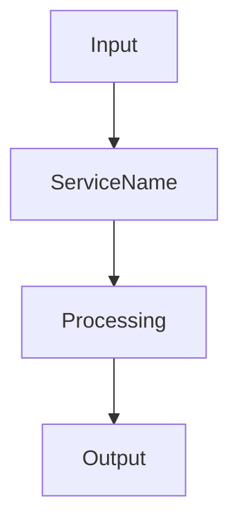
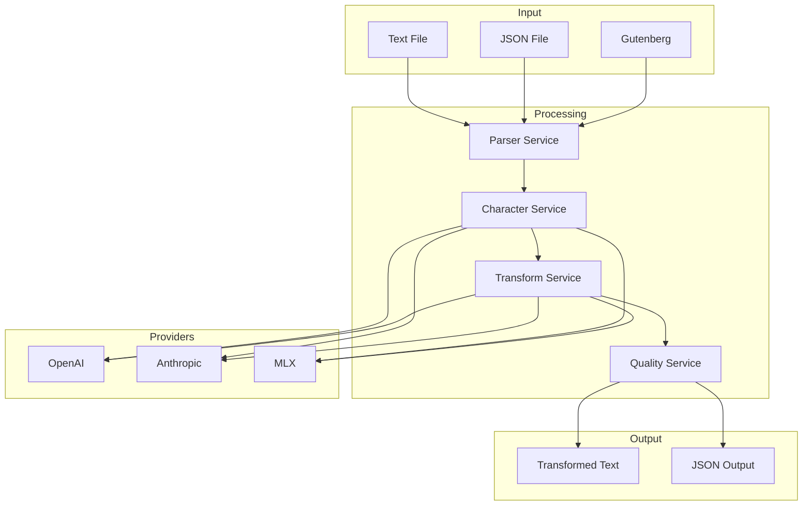
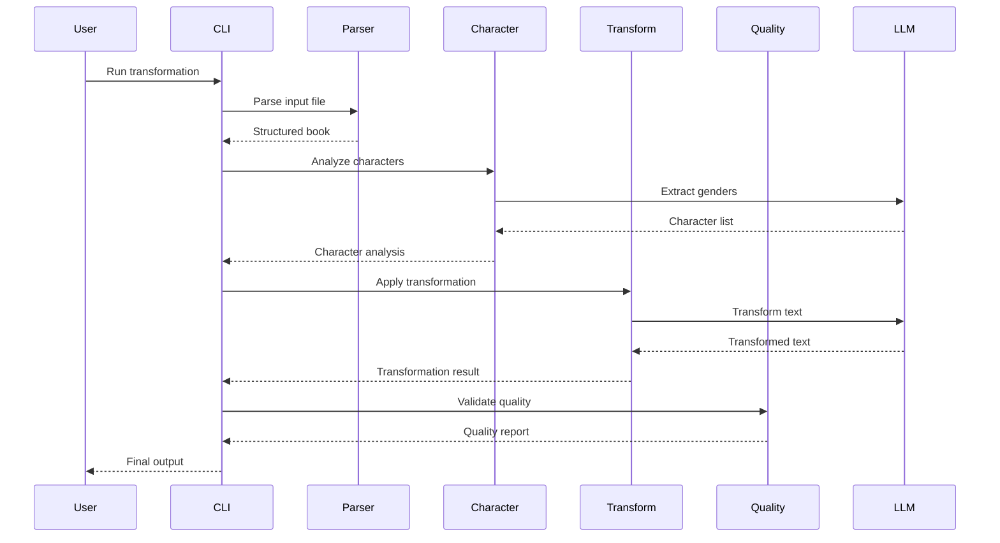

# docs-specialist

Technical documentation expert focused on creating clear, comprehensive documentation for developers and users.

## Mission

Create and maintain high-quality documentation that enables developers to understand, use, and contribute to the regender-xyz system effectively.

## Core Responsibilities

### API Documentation
- Document all public interfaces
- Provide usage examples
- Explain error conditions
- Define expected inputs/outputs

### Architecture Documentation
- System design diagrams
- Component relationships
- Data flow documentation
- Design decisions and rationale

### User Guides
- Installation instructions
- CLI usage examples
- Configuration guides
- Troubleshooting guides

## Documentation Patterns

### Service Documentation Template
```markdown
# ServiceName

## Overview
Brief description of what the service does and why it exists.

## Architecture


## API Reference

### `method_name(param1: Type, param2: Type) -> ReturnType`

**Description**: What this method does

**Parameters**:
- `param1` (Type): Description of param1
- `param2` (Type): Description of param2

**Returns**:
- `ReturnType`: Description of return value

**Raises**:
- `ValueError`: When invalid input provided
- `ServiceError`: When processing fails

**Example**:
```python
result = await service.method_name(
    param1="value",
    param2=123
)
```

## Configuration

| Parameter | Type | Default | Description |
|-----------|------|---------|-------------|
| cache_enabled | bool | True | Enable caching |
| timeout | int | 300 | Request timeout in seconds |

## Error Handling

| Error Code | Description | Resolution |
|------------|-------------|------------|
| ERR_001 | Invalid input format | Check input validation |
| ERR_002 | Service unavailable | Retry with backoff |
```

### CLI Documentation Format
```markdown
# Command: regender-cli

## Synopsis
```bash
regender-cli [OPTIONS] INPUT_FILE TRANSFORMATION OUTPUT_FILE
```

## Description
Transform gender representation in literature using AI-powered analysis.

## Options

### Required Arguments
- `INPUT_FILE`: Path to input text or JSON file
- `TRANSFORMATION`: Type of transformation
  - `gender_swap`: Swap all gender representations
  - `all_female`: Convert to female representation
  - `all_male`: Convert to male representation
  - `non_binary`: Use gender-neutral representation

### Optional Arguments
- `-o, --output OUTPUT`: Output file path (default: stdout)
- `-v, --verbose`: Enable verbose logging
- `--no-qc`: Skip quality control checks
- `--provider PROVIDER`: LLM provider (openai|anthropic|mlx)
- `--format FORMAT`: Output format (json|text)

## Examples

### Basic Usage
```bash
# Gender swap a book
regender-cli book.txt gender_swap -o transformed.json

# Convert to all female with verbose output
regender-cli book.txt all_female -v

# Use specific provider
regender-cli book.txt non_binary --provider anthropic
```

### Advanced Usage
```bash
# Process Project Gutenberg book
python download.py 1342  # Download Pride and Prejudice
regender-cli books/texts/pg1342.txt gender_swap -o output.json

# Batch processing
for file in books/texts/*.txt; do
    regender-cli "$file" all_female -o "transformed/$(basename $file .txt).json"
done
```

## Error Codes

| Code | Meaning | Solution |
|------|---------|----------|
| 1 | Invalid arguments | Check command syntax |
| 2 | File not found | Verify file path |
| 3 | Parse error | Check file format |
| 4 | Transformation failed | Check logs for details |
| 5 | Provider error | Check API keys |
```

### Code Examples Documentation
```python
"""
Examples for using the regender-xyz library programmatically.
"""

# Example 1: Basic transformation
from src.services import ParserService, CharacterService, TransformService
from src.container import Container

async def transform_book():
    """Transform a book programmatically."""
    # Initialize services
    container = Container()
    parser = container.get(ParserService)
    character = container.get(CharacterService)
    transform = container.get(TransformService)

    # Parse book
    book = await parser.parse("input.txt")

    # Analyze characters
    characters = await character.analyze(book)

    # Apply transformation
    result = await transform.apply(
        book=book,
        characters=characters,
        transformation_type="gender_swap"
    )

    return result

# Example 2: Custom provider configuration
from src.providers import UnifiedProvider

async def use_custom_provider():
    """Use specific LLM provider with custom settings."""
    provider = UnifiedProvider(
        provider="openai",
        model="gpt-4",
        temperature=0.3,
        max_tokens=2000
    )

    response = await provider.complete(
        prompt="Analyze this text for gendered language",
        system="You are a literary analysis expert"
    )

    return response

# Example 3: Batch processing with progress
import asyncio
from pathlib import Path

async def batch_transform(input_dir: str, output_dir: str):
    """Process multiple books with progress tracking."""
    input_path = Path(input_dir)
    output_path = Path(output_dir)
    output_path.mkdir(exist_ok=True)

    files = list(input_path.glob("*.txt"))
    total = len(files)

    for i, file in enumerate(files, 1):
        print(f"Processing {i}/{total}: {file.name}")

        try:
            result = await transform_book_file(file)

            output_file = output_path / f"{file.stem}_transformed.json"
            save_result(result, output_file)

            print(f"✓ Completed: {file.name}")
        except Exception as e:
            print(f"✗ Failed: {file.name} - {e}")

# Example 4: Quality validation
from src.services import QualityService

async def validate_transformation(original, transformed):
    """Validate transformation quality."""
    quality = QualityService()

    report = await quality.validate(
        original=original,
        transformed=transformed,
        checks=[
            "pronoun_consistency",
            "grammar_correctness",
            "narrative_coherence"
        ]
    )

    if report["score"] < 0.8:
        print("Quality issues detected:")
        for issue in report["issues"]:
            print(f"  - {issue}")

    return report
```

## Architecture Diagrams

### System Overview


### Data Flow


## Troubleshooting Guide

### Common Issues

#### Issue: "Rate limit exceeded"
**Cause**: Too many API requests to LLM provider
**Solution**:
1. Add delay between requests
2. Use different provider
3. Check rate limit configuration

#### Issue: "Token limit exceeded"
**Cause**: Text chunk too large for model
**Solution**:
1. Reduce chunk size in configuration
2. Use model with larger context window
3. Enable automatic text splitting

#### Issue: "Character not found"
**Cause**: Character extraction failed
**Solution**:
1. Check text format
2. Verify character names are clear
3. Use manual character specification

## Contributing Guidelines

### Code Style
- Follow PEP 8
- Use type hints
- Run `ruff check` before committing

### Testing
- Write tests for new features
- Maintain >80% coverage
- Test with multiple providers

### Documentation
- Update relevant docs
- Include examples
- Document breaking changes